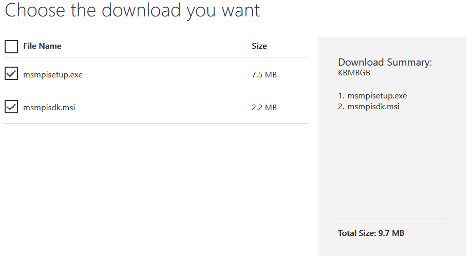
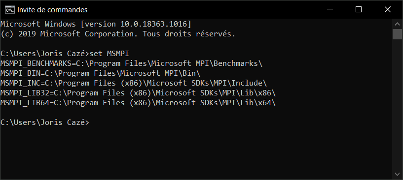

How to install OpenMPI for Visual Studio
========================================

To run parallel applications on Windows platform using Visual Studio you will have to use Microsoft MPI (MS-MPI).
This is the Microsoft implementation of the Message Passing Interface standard.

The source code is available on [GitHub](https://github.com/Microsoft/Microsoft-MPI) (open-source).

General information about MS-MPI is available on official [Microsoft documentation](https://docs.microsoft.com/en-us/message-passing-interface/microsoft-mpi?redirectedfrom=MSDN). 

On the section `Downloads` you will find latest MS-MPI version.
Make sure that `msmpisetup.exe` and `msmpisdk.msi` are selected:

Once done, just double-click on each installer and follow the steps in the installation wizard.

After the installation you can verify that the MS-MPI environment variables have been set (these variables are used by Visual Studio) with the following command on CMD console:

Reference: https://docs.microsoft.com/en-us/archive/blogs/windowshpc/how-to-compile-and-run-a-simple-ms-mpi-program