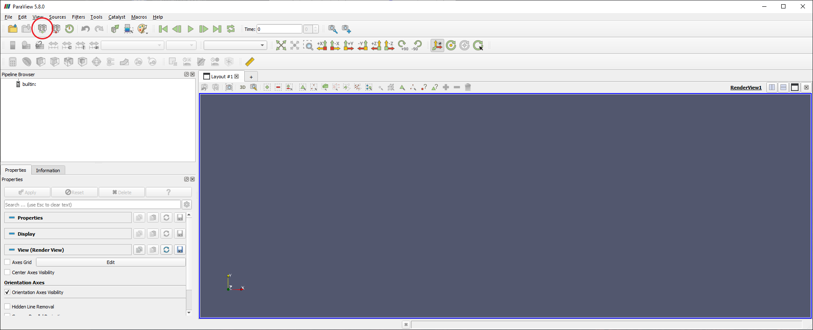
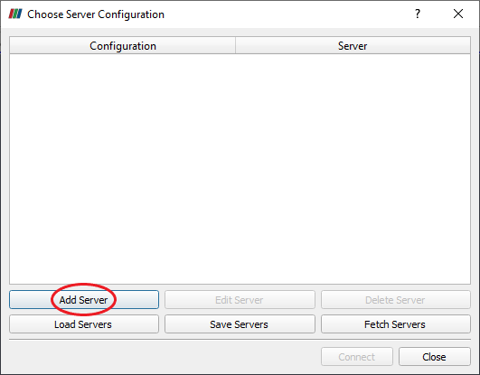
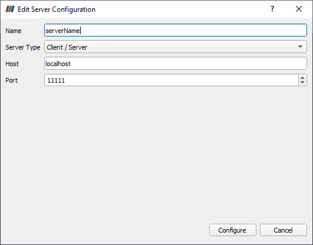
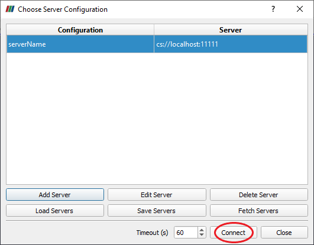

# ParaView Server

## Install ParaView

### Install ParaView

To install Paraview on your server directly go to the official [ParaView website](https://www.paraview.org/). 
Under Linux section you can find either full suite of ParaView tools including ParaView GUI client or the headless version if don't plan to render with an X server. 
For the example we will download the complete version and unzip it:

```
$ wget -O ParaView-5.8.1-MPI-Linux-Python3.7-64bit.tar.gz "https://www.paraview.org/paraview-downloads/download.php?submit=Download&version=v5.8&type=binary&os=Linux&downloadFile=ParaView-5.8.1-MPI-Linux-Python3.7-64bit.tar.gz"
$ tar -xvf ParaView-5.8.1-MPI-Linux-Python3.7-64bit.tar.gz
$ rm ParaView-5.8.1-MPI-Linux-Python3.7-64bit.tar.gz
```

Note that it is strongly recommended to use the same ParaView version on the client side to avoid incompatibility problems.


## Setup ParaView server

In order to easily run ParaView executables we will add its bin folder to the `PATH` environment variable. 
Assuming ParaView has been installed into the folder `/home/userName/Softwares/` we can edit the path as:

```
$ sudo echo 'export PATH=/home/userName/Softwares/ParaView-5.8.1-MPI-Linux-Python3.7-64bit/bin:$PATH' >> /home/userName/.bashrc
$ source /home/userName/.bashrc
```

To start ParaView server run the `pvserver` executable with the MPI executable provided by ParaView (`-np 1` for sequential use):

```
$ mpiexec -np 1 pvserver --force-offscreen-rendering
Waiting for client...
Connection URL: cs://serverName:11111
Accepting connection(s): serverName:11111
```

By default we can see that a ParaView server has been started on the server `serverName` (will be replaced by the actual name of your server) and is waiting for connection on the port `11111`. 
If one would like to change the default port we can add the option `--server-port=XXXXX`.


## Connect to ParaView server with client

### Prerequisites

To access to the ParaView server we need to forward a port from the client machine (`localhost` here) to the server machine (`serverName`). 
As stated in the reference below it will allow the ssh client to listen for connections on a given port, once a connection is received the ssh client will tunnel to the ssh server. 
Lastly, the ssh server connects to an another destination given port, i.e. the one used by the ParaView server.
This procedure is called local forwarding and is configured with the `-L` option.
On the client machine one can use:

```
ssh -X -N -L localhost:11111:serverName:11111 user@serverName
```

Here it has been added options `-X` to enable X11 forwarding (to export application display) and `-N` to specify that it is not necessary to execute a remote command (stick only to port forwarding).

Be aware that the previous command will not give any output and will stay up until you would like to end-up the connection.
If you would like to set this command to background add the `-f` flag.

To avoid to remember the previous ssh command an alias can be added:

```
$ vim ~/.bash_aliases
$ alias ssh-port='ssh -X -f -N -L localhost:11111:serverName:11111 user@serverName'
```

Now to do to port forwarding run:

```
$ ssh-port
```

Reference: [ssh tunneling](https://www.ssh.com/ssh/tunneling/example)

### ParaView client usage

The final step is to connect to the ParaView server directly from your ParaView client. 
To proceed, open the ParaView client GUI and click on the *Connect* button:



Add your server as described below (keep manual configuration and save):





Connect to your server:

