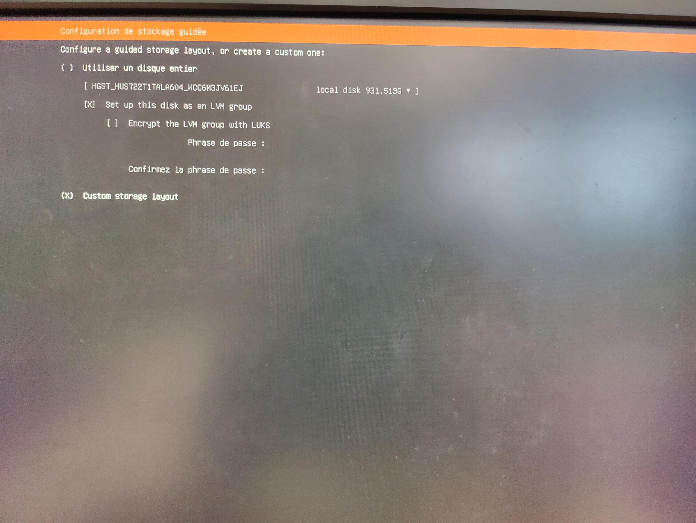
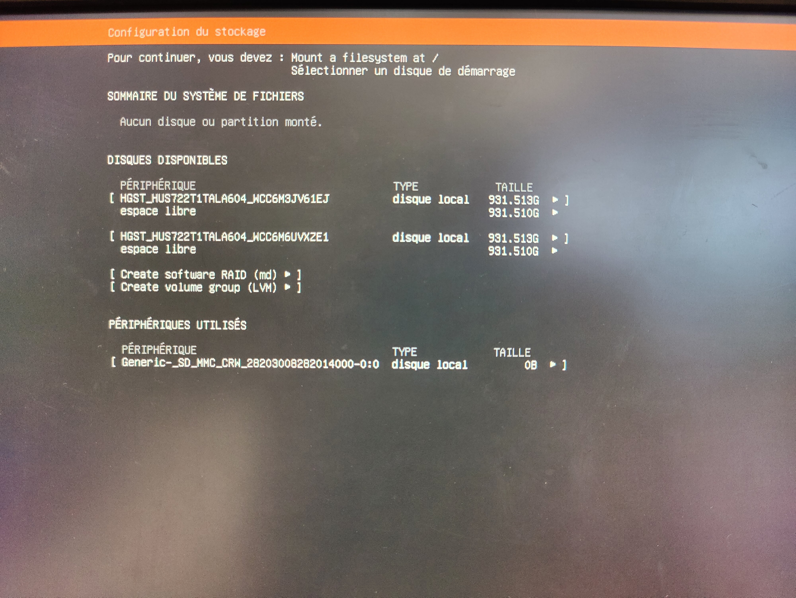
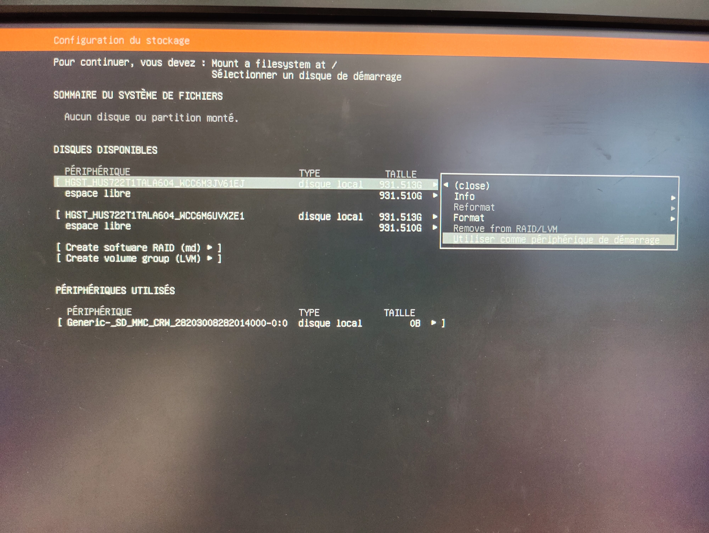
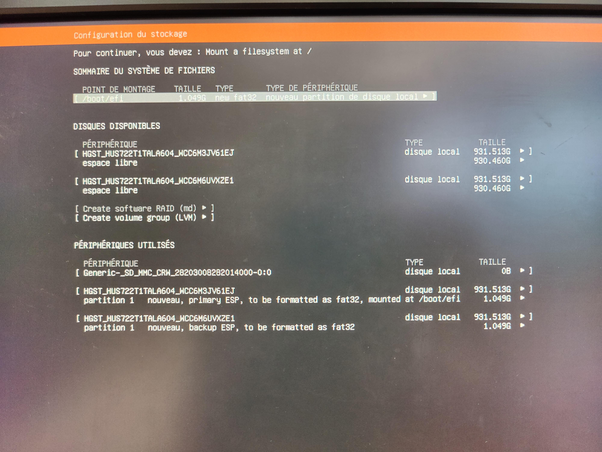
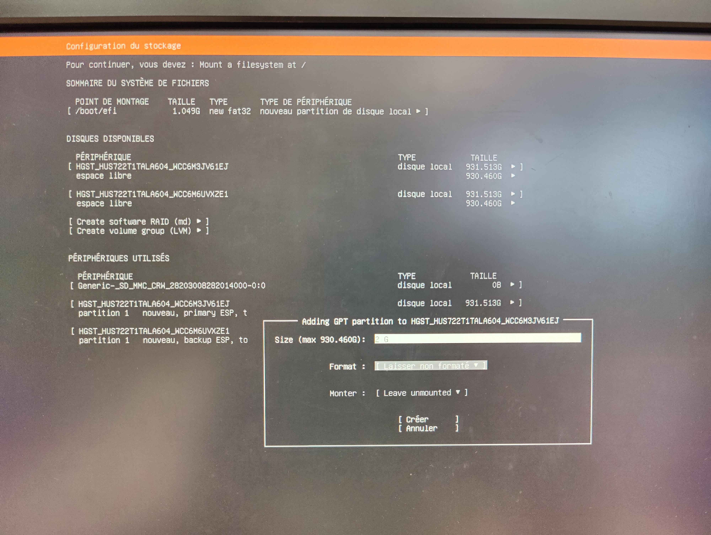
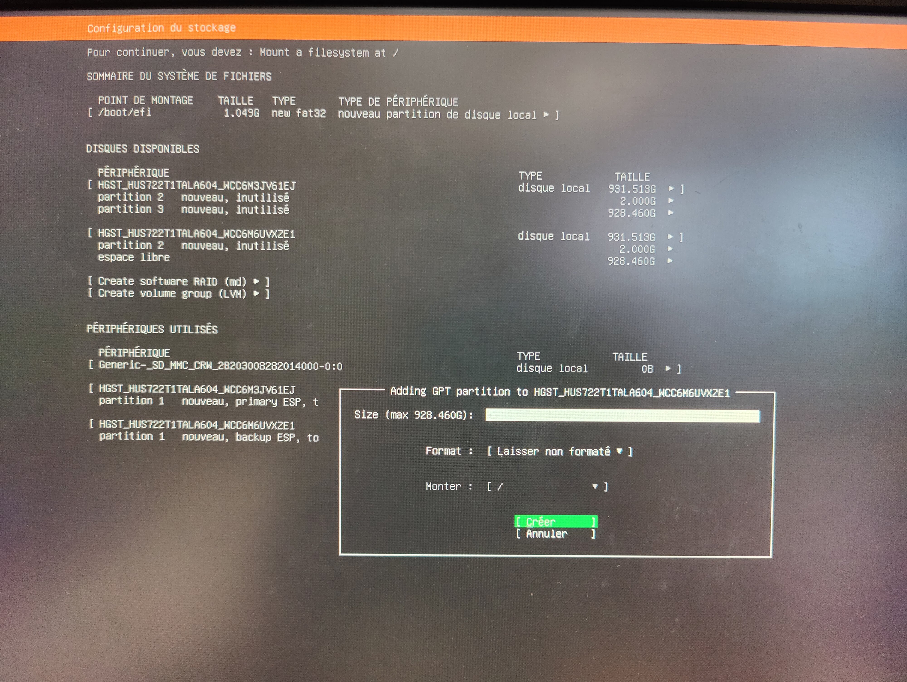
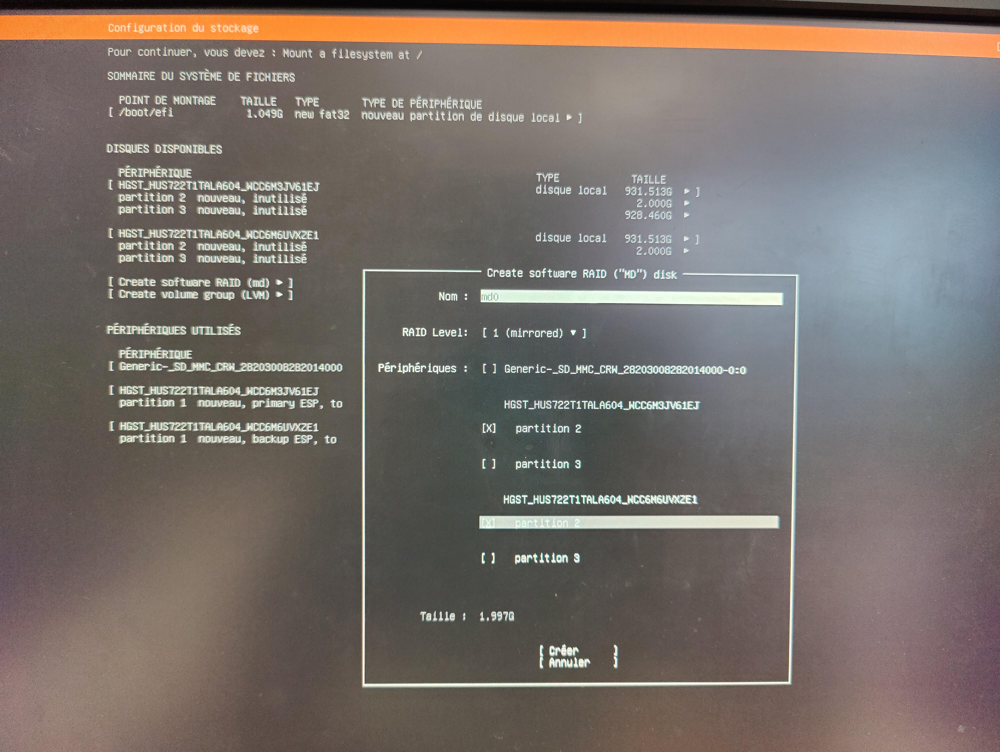
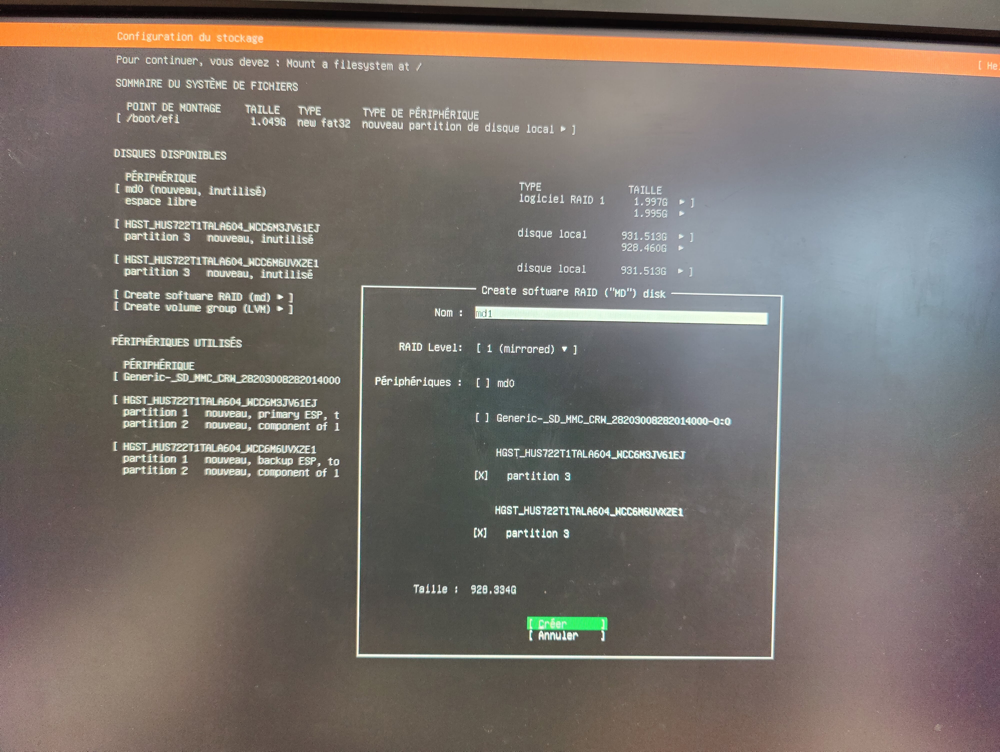
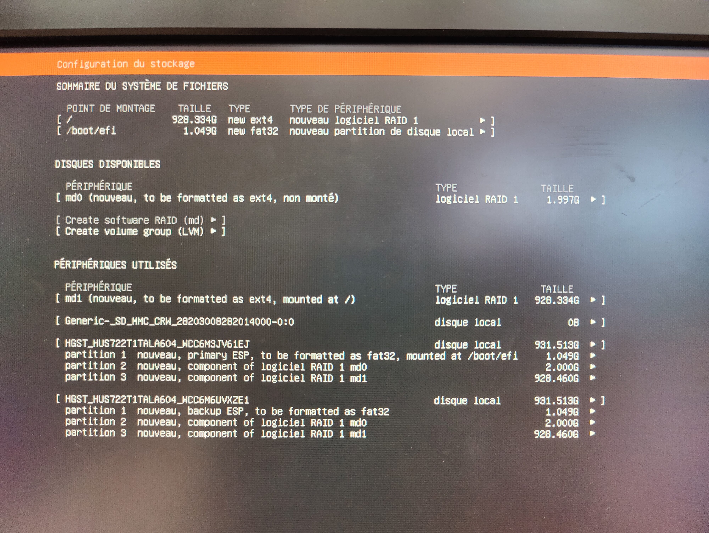

# RAID


## Info setup RAID on Ubuntu

To perform RAID configurations on Ubuntu Server, the software `mdadm` is used. 
RAID 1 is chosen to achieve complete disk redundancy.

1. RAID on / --> fresh install of Ubuntu Server

During server configuration, there is a utility that allows to setup RAID configuration.
This is particularly useful when configuring RAID on the root / partition, as it requires the disks to be unmounted.

- [Video for Ubuntu Server 22.04](https://www.youtube.com/watch?v=rJzHpc1kQW4)
    - Set both disks as boot devices to create Boot partitions.
    - Create an unformatted and unmounted partition on both disks.
    - Create a software RAID of level 1 and select the two previous partitions.
    - Format the RAID partition as ext4 and ensure the mount point is /.

2. RAID on / --> on an existing installation

Configuring RAID on the root partition of an existing installation is more challenging. 
However, it seems possible, even though the references provided are old:

- https://doc.ubuntu-fr.org/tutoriel/raid1_logiciel_sur_installation_existante
- https://www.howtoforge.com/how-to-set-up-software-raid1-on-a-running-system-incl-grub2-configuration-ubuntu-10.04
- https://doc.ubuntu-fr.org/tutoriel/raid1_software

3. RAID on partitions other than the root

Configuring RAID on partitions other than the root is much easier. 
Refer to the article: https://www.digitalocean.com/community/tutorials/how-to-create-raid-arrays-with-mdadm-on-ubuntu-22-04#creating-a-raid-1-array


## Sum up of useful commands

Summary article of all the useful commands: [How to Manage RAID Arrays with mdadm on Ubuntu 22.04](https://www.digitalocean.com/community/tutorials/how-to-manage-raid-arrays-with-mdadm-on-ubuntu-22-04)

- List devices, partitions, and mount points: `lsblk` or `df -h`
- Display detailed information about disks and partitions: `sudo fdisk -l`
- Display RAID status (D: detailed): `sudo mdadm -D /dev/md0`
- Manually mark a disk as faulty (even if it doesn't have any issues): `sudo mdadm /dev/md0 --fail /dev/sdbX`
- Remove a disk from the RAID array to physically detach it: `sudo mdadm /dev/md0 --remove /dev/sdbX`
- Add a disk to a RAID array: `sudo mdadm /dev/md0 --add /dev/sdbX`
- List RAID devices and their information: `cat /proc/mdstat`
- Create a simple RAID array (not working for the whole the file system): 
  `sudo mdadm --create --verbose /dev/md0 --level=1 --raid-devices=2 /dev/sda /dev/sdb`
- `mdadm` configuration file: */etc/mdadm/mdadm.conf*
- Display system logs (`-k` for kernel messages, `-e` for only the latest logs): `journalctl -k -e` (useful for checking if a disk is properly connected to the SATA port)


## RAID functionality verification tests

1. Simulate disk failure and replacement

- Check the array status and if a disk is failed: `sudo mdadm --detail /dev/md0`
- To remove a disk without issues, manually mark it as faulty: `sudo mdadm /dev/md0 --fail /dev/sdc`
- Remove the disk: `sudo mdadm /dev/md0 --remove /dev/sdc`

2. Functionality tests

- Declare the first disk as faulty, remove it while the system is running, then reboot to see if it boots on the second disk.
- Power off the machine again, reconnect the first disk, boot up, and add partitions to the RAID arrays. Verify that synchronization occurs correctly.


## Information for booting from any disk

There are two options to enable booting from any disk:

1. Boot duplication

A boot partition is created on each disk, and the boot partition from the first disk is copied to the second one.
The boot on the first disk is unmounted, and the second disk is mounted. GRUB is reconfigured to allow booting from this partition.
-> This method requires reinstalling the bootloader on each disk, and in case of a failure, the disk where the bootloader is mounted needs to be changed.
Very old tutorial: https://doc.ubuntu-fr.org/tutoriel/raid1_software

2. Boot from RAID Partition

GRUB appears to be capable of booting from a RAID partition like */dev/mdX*.

A solution using RAID partition: [Ask Ubuntu](https://askubuntu.com/questions/1234949/install-ubuntu-20-04-focal-fossa-with-raid-1-on-two-devices)
In this method, the disks are declared as boot devices, but a boot partition is also created on each disk, which is mounted in RAID.
In my configuration, both disks are designated as boot devices, but I did not have the */boot* partition in RAID.
I'm not sure if this solution is relevant because I have the */dev/sda1* partition mounted on /boot/efi.
-> Test by removing the first disk to see if boot fails
This method seems to be compatible only with Legacy BIOS and not with UEFI, which uses an EFI partition.

Refer to the Ubuntu documentation for information on custom disk configurations as well: https://ubuntu.com/server/docs/install/storage

A very old tutorial that mentions booting from RAID with GRUB: https://doc.ubuntu-fr.org/tutoriel/raid1_software


## Boot configuration on RAID Partition + RAID for /

In the Ubuntu Server configuration tool, choose a custom disk setup and perform the following operations:
- Create a boot device partition on each disk (which will not be used in the long term as it cannot be managed in RAID)
- Create a partition to accommodate the future bootloader on each disk (2 GB for ample space), do not specify a mount point, and leave it unformatted
- Create the RAID array */dev/md0* for the bootloader, composed of the two previous partitions (without mounting it (be careful misleading sreenshot below))
- Format this array as FAT32 (required for the EFI System Partition (ESP)) and **do not mount it** (if FAT32 formatting is not possible in the utility, perform it after the installer setup is done)
- Create a partition with the remaining storage space on each disk, leaving it unformatted and unmounted
- Create the RAID array */dev/md1* for the system root, format it as *ext4*, and mount it at */*
- Complete the regular installation using the configuration tool

Below the screenshots corresponding to the tasks described above:











Once the configuration is completed and the server is rebooted, the bootloader needs to be set up on RAID.
To do so:
- Format the future bootloader RAID array */dev/md0* as FAT32 (if not already done): `sudo mkfs.fat -F32 /dev/md0`
- Create a temporary mount point: `sudo mkdir /mnt/boot2`
- Mount the */dev/md0* array, which will house the new bootloader, to a temporary mount point: `sudo mount /dev/md0 /mnt/boot2`
- Copy the contents of */boot/efi* to */dev/md0*: `sudo cp -r /boot/efi/* /mnt/boot2/`
- Retrieve the UUID of RAID */dev/md0*: `sudo blkid /dev/md0`
- Update the filesystem mount entries in *fstab* by replacing the UUID of the */boot/efi* mount point with that of */dev/md0*: `sudo vim /etc/fstab`
The content of the *fstab* file should then resemble the following (note that the RAID */dev/md1* for the root should have been correctly written by the Ubuntu Server configuration tool):

```sh
UUID=UUID_of_md1 / ext4 defaults 0 1
UUID=UUID_of_md0 /boot/efi vfat defaults 0 1
```

- Restart the server to verify that booting from */dev/md0* works
- Verify that the following structure is present:

```sh 
sda       8:0    0 931,5G  0 disk  
├─sda1    8:1    0     1G  0 part  
├─sda2    8:2    0     2G  0 part  
│ └─md0   9:0    0     2G  0 raid1 /boot/efi
└─sda3    8:3    0 928,5G  0 part  
  └─md1   9:1    0 928,3G  0 raid1 /
sdb       8:16   0 931,5G  0 disk  
├─sdb1    8:17   0     1G  0 part  
├─sdb2    8:18   0     2G  0 part  
│ └─md0   9:0    0     2G  0 raid1 /boot/efi
└─sdb3    8:19   0 928,5G  0 part  
  └─md1   9:1    0 928,3G  0 raid1 /
```

- With *sda1* and *sdb1* representing the boot device partitions initially created by the Ubuntu Server configuration tool but no longer used.
- Partitions *sda2* and *sdb2* are mounted in RAID to form the *md0* device and contain the bootloader associated with the */boot/efi* mount point.
- Partitions *sda3* and *sdb3* are mounted in RAID to form the *md1* device and contain the file system associated with the */* mount point.


## Disk replacement procedure after failure

The SATA controller does not support hot swapping of disks (according to my tests), and a hardware RAID might be required.
Below is the procedure for cold disk replacement, i.e., with the machine powered off.

- Check the status of the RAID arrays (boot and system): `sudo mdadm -D /dev/md0`, `sudo mdadm -D /dev/md1`. It should indicate that a disk is in a failed state.
- Remove the partitions of the failed disk from each RAID array: `sudo mdadm /dev/md0 --remove /dev/sdb2` and `sudo mdadm /dev/md1 --remove /dev/sdb3`
- Shutdown the server: `sudo shutdown -h now` and replace the disk
- Boot the server
- Verify that the disk is properly detected: `lsblk` or `sudo fdisk -l`
- Copy the partition table from the valid */dev/sda* disk to the new replacement disk */dev/sdb*: `sudo sfdisk -d /dev/sda | sudo sfdisk /dev/sdb`
- Verify the partitions: `lsblk`
- Clean up any remaining traces of a previous RAID installation on the new disk (not necessary if it's a new disk, but it doesn't hurt):
  `sudo mdadm --zero-superblock /dev/sdb2`
  `sudo mdadm --zero-superblock /dev/sdb3`
  If nothing remains from a previous installation, each of these commands will return an error like:
  `mdadm: Unrecognised md component device - /dev/sdb1`
  Otherwise, nothing will be displayed.
- Add the new partitions to the corresponding RAID arrays:
  `sudo mdadm /dev/md0 --add /dev/sdb2`
  `sudo mdadm /dev/md1 --add /dev/sdb3`
- Check the status of the RAID and disk synchronization:
  `sudo mdadm -D /dev/md0`, `sudo mdadm -D /dev/md1`.


## Prepare a disk from scratch

- Delete all partitions: `sudo fdisk /dev/sdb`
  - Type `d` to delete each partition
  - Type `w` to write the changes and exit
- Add a partition: `sudo fdisk /dev/sdb`
  - Type `n` and choose the partition size
- Format a partition:
  - With a Linux filesystem: `sudo mkfs.ext4 /dev/sdb`
  - With a FAT32 filesystem (useful for bootloader or USB drive, for example): `sudo mkfs.fat -F32 /dev/sdb`


## Send email in case of disk problem

Install and configure an email client such as Sendmail or Postfix (see the documentation *mail.md*).

### Email only in case of disk problem

To be notified by email in case there is a problem with the RAID array, the script below can be used. 

Here the `mdadm` RAID tool is ran in test mode on the RAID array of interest.
This mode allows to get an error code in case of any problems (!= 0). 
If any error occurs, the whole status of the RAID setup is sent by email to the admin of the server.

```sh
#!/bin/bash

# Check if there is a problem of disk in the RAID array

/usr/sbin/mdadm --detail --test /dev/md1 &> /dev/null

if [ "$?" != "0" ]
then
        cat /proc/mdstat > /var/log/raid-status.txt
        /usr/bin/mail -s "Disk problem on alfred server" user@example.com -a From:server@example.com < /var/log/raid-status.txt
        rm /var/log/raid-status.txt
fi
```

This script could be stored in */usr/local/bin/* to be in the PATH and use executable permissions with root ownership. 

Define a system cron job to run every every day at 1 AM: 

```sh
sudo crontab -e
0 1 * * * /usr/local/bin/raid.sh
```

### Automatic email with RAID status

In case you want to receive a report of the RAID status automatically, follow the method presented below.

- Configure `mdadm` email notifications

Open the mdadm configuration file */etc/mdadm/mdadm.conf* in a text editor. 
If the file doesn't exist, you can create it and the data of your current RAID devices:

```sh
sudo mdadm --detail --scan --verbose | sudo tee -a /etc/mdadm/mdadm.conf
```

Add the following lines to the file:

```sh
MAILADDR your_email@example.com
MAILFROM mdadm@your_hostname
```

Replace `your_email@example.com` with the email address where you want to receive notifications, and `your_hostname` with the hostname of your machine.

- Test the email configuration

To ensure that your email configuration is working correctly, you can use the `mdadm` command with the `--monitor` option to manually simulate a disk failure and check if you receive an email notification. 
Run the following command:

```sh
sudo mdadm --monitor --scan --test --oneshot
```

If your email configuration is correct, you should receive an email with details about the simulated disk failure. 
If you don't receive an email, double-check your email client configuration and the *mdadm.conf* file.

- Schedule email notifications 

To automate the monitoring and email notifications, you can add a cron job to periodically check the status of the RAID array. Open a terminal and run the following command to edit the crontab file: `crontab -e`.

Add the following line to the file to run the monitoring command every day at 1 AM:

```sh
0 1 * * * sudo mdadm --monitor --scan --oneshot
```